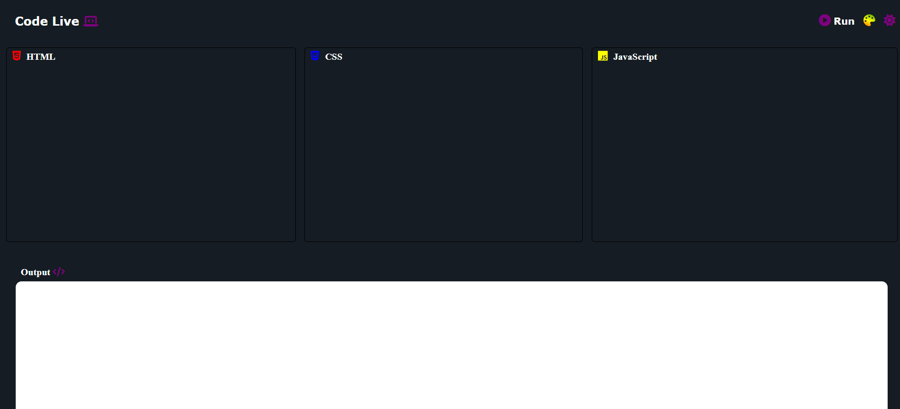

# CodeLive

Live Demo: [Code Live](https://codeliveweb.netlify.app)

# Image



# About

This Code Editor Web App is a simple web application that allows users to run HTML, CSS and javaScript code online.

## Installation

Follow these steps to install and run the Code Live Web App:

 **Clone the Repository:**

   ```bash
    gh repo clone Iamaniketgupta/CodeLive
    cd CodeLive
```

## Usage

Open the html file or Use Live Server in Vs code.

# License

This Code Editor App is licensed under the MIT License. Feel free to use, modify, and distribute it as per the license terms.

## Author

- **Aniket Gupta**
  - GitHub: [@iamaniketgupta](https://github.com/iamaniketgupta)


